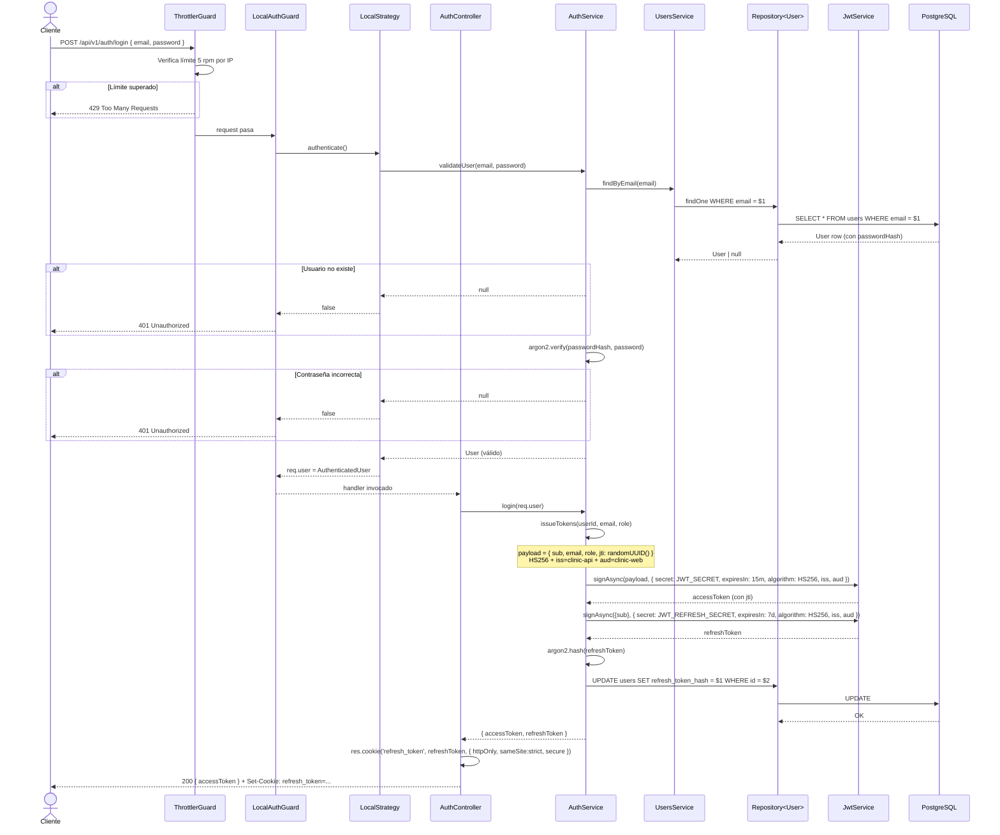
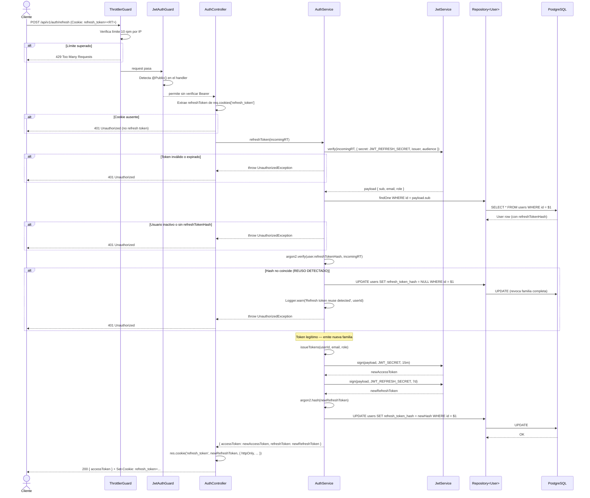
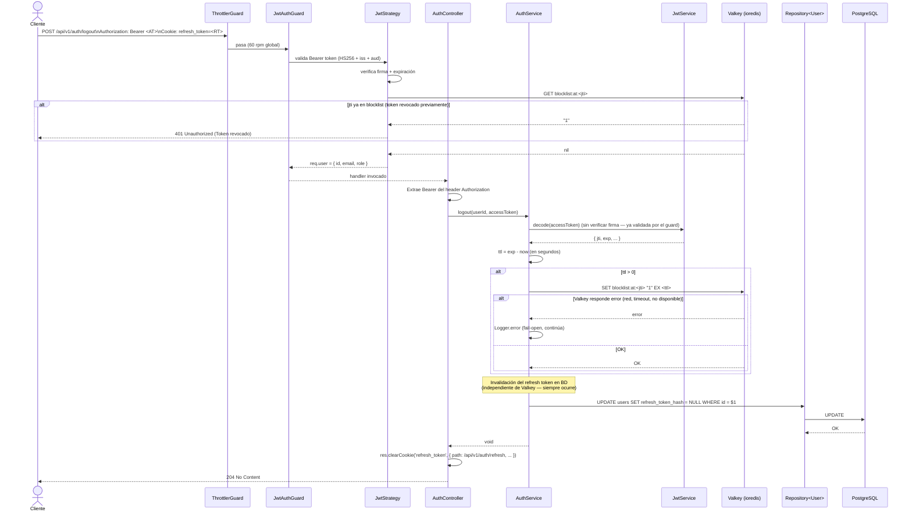
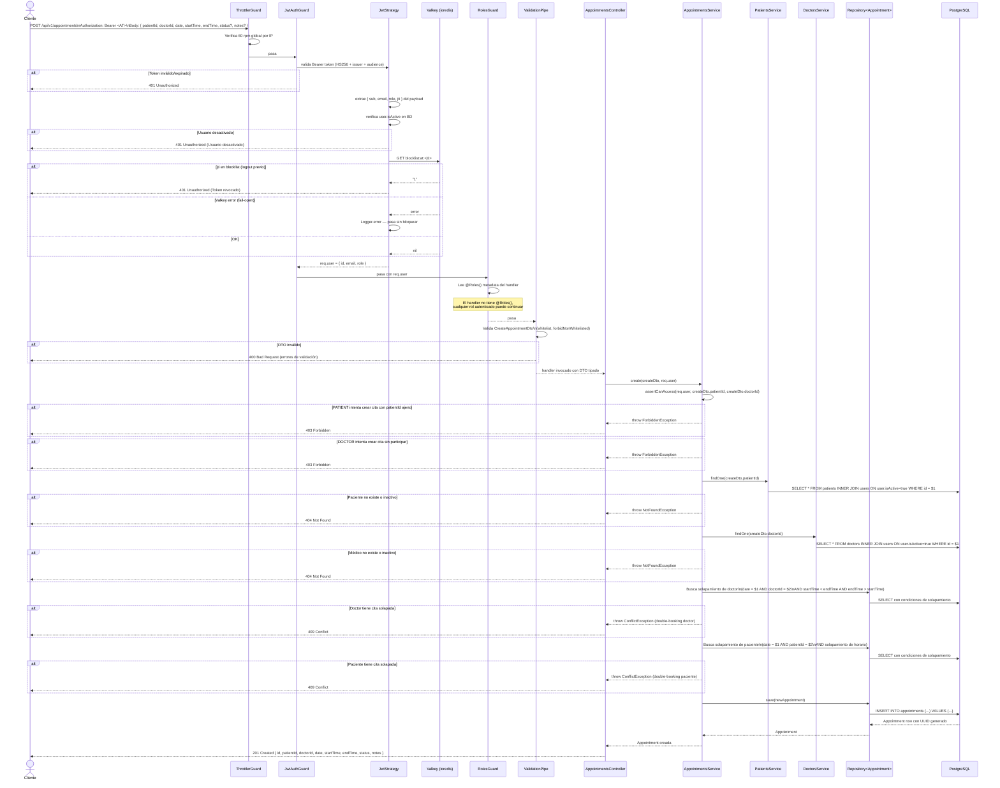

# Diagramas de Secuencia — Clinic API

Los cuatro flujos más críticos de la API son:

1. **Login con emisión de tokens** — el punto de entrada de toda sesión autenticada
2. **Refresco de token con detección de reuso** — rotación + detección de robo
3. **Logout con revocación de access token vía blocklist** — invalidación en tiempo real
4. **Creación de cita médica con validaciones de negocio** — el flujo de dominio central

---

## Flujo 1: Autenticación (POST /api/v1/auth/login)

---

## Flujo 2: Refresco de token (POST /api/v1/auth/refresh)

Este flujo implementa **refresh token rotation** con detección de reuso: si el hash almacenado no coincide con el token recibido, se revoca toda la familia (logout forzado).

---

## Flujo 3: Logout con revocación de access token (POST /api/v1/auth/logout)

Logout invalida ambos tokens: el refresh token se borra de BD (`refresh_token_hash = NULL`) y el access token se añade a la blocklist de Valkey usando su `jti` como clave, con TTL igual al tiempo restante hasta su expiración natural. La estrategia es *fail-open*: si Valkey falla, el refresh se invalida igualmente y solo el access token quedaría activo hasta su expiración corta.

A partir de este momento, cualquier intento de usar el access token revocado verá la entrada en `blocklist:at:<jti>` y será rechazado por `JwtStrategy.validate()`. La entrada se auto-elimina cuando expira el TTL, sin necesidad de limpieza manual.

---

## Flujo 4: Creación de cita médica (POST /api/v1/appointments)

Este flujo concentra las validaciones más complejas: autenticación, blocklist check, RBAC, ownership del patientId, validación del doctorId y prevención de double-booking.

